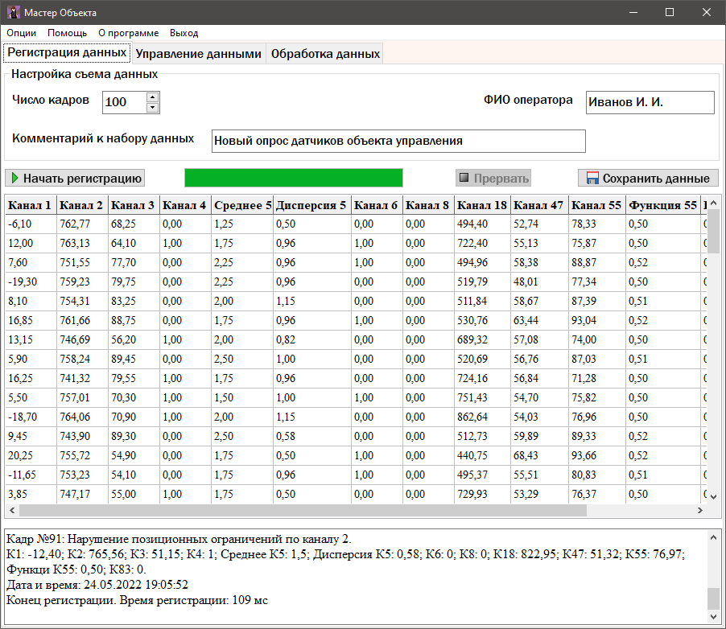
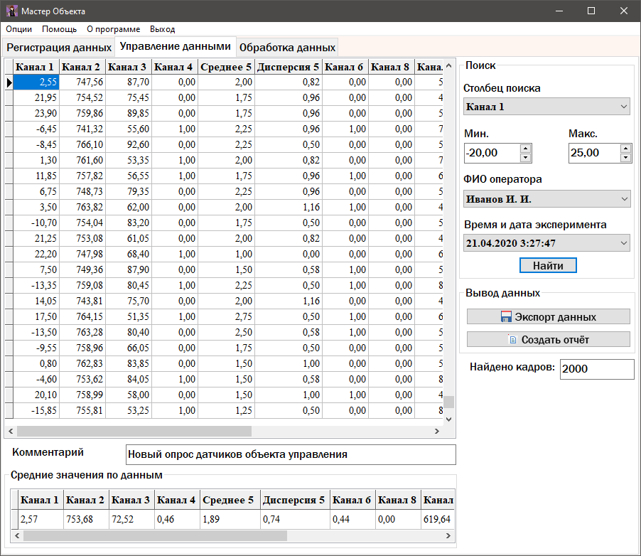
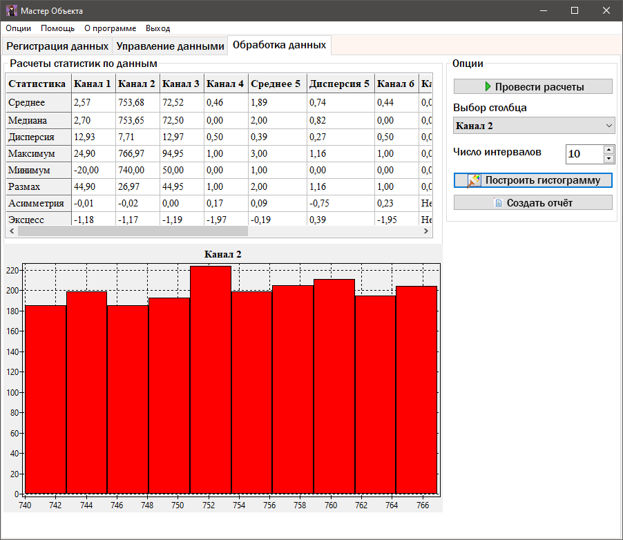

# FacilityMaster
Программный комплекс позволяет опрашивать по измерительным каналам датчики, 
осуществляющие измерения некоторых физических величин, проводить первичную обработку, 
сохранять полученные данные с возможностью отбора и упорядочивания данных, проводить 
дальнейшую обработку над сохранёнными данными.

Хранение данных производится в таблице формата dbf с возможность добавления и извлечения хранящихся в ней данных.

На основании полученных данных программа выдает отчеты в формате xlsx.

## 
Программа написана на языке Object Pascal с использованием IDE Lazarus версии 2.0.6.

Также использовалась библиотека laz_fpspreadsheet 1.10.1 для работы с xlsx файлами.

Структура проекта:
```
FacilityMaster.lpi       # Главный файл проекта
Main.pas                 # Модуль основной логики программы
about.pas                # Модуль описания программы
intrfcD.PAS              # Модуль имитации объекта управления
test.pas                 # Модуль для измерения скорости выполнения функций
FacilityMaster.exe       # Скомпилированный файл программы
```

##








